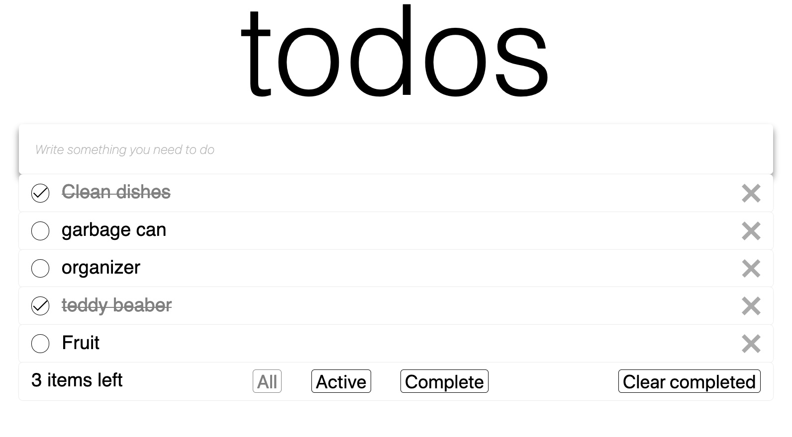

# Todo App

This todo application is based in [todomvc](todomvc.com) layout.
Created using JavaScript, and the bundle configuration was made using webpack.

## Screenshot

## Scripts

  `npm test`
  > start jest and run the test.

  `npm start`
  > start webpack in development mode runing at `http://localhost:8080`.

  `npm run build`
  > start webpack bundler and create the `docs` folder.

  #### know issues
   - initial list hard coded.
   - clear completed button is not working properly.